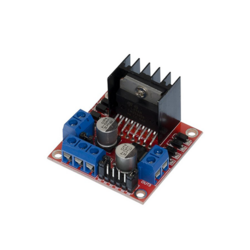
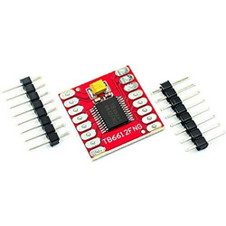
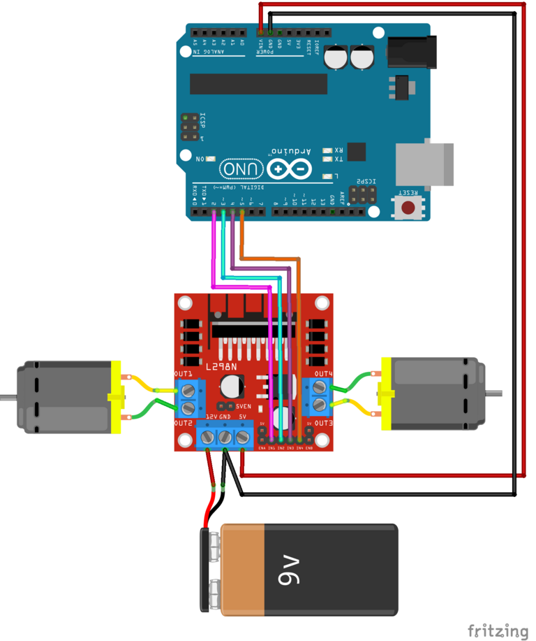

# 08.Motor Control!A great step to a small goal!
## Motor Control
Typically , we only control **DC motor** in our projects, sometimes we may use **stepper motor**.

Thus, in this chapter, we will learn how to control DC motor only.
## 1. Most Used Motor Drivers
### 1.1 Purpose:
Actually , we use motor drivers for three reasons:
- **Supply power to motors**
- **Control motor direction**
- **Control motor speed**
### 1.2 Motor drivers:

| L298N                                             | TB6612                                                            |
| ------------------------------------------------- | ----------------------------------------------------------------- |
|  |  |

Due to MCU IOs are limited , thus we need motor drivers to finish these jobs.

There are two widely used motor drivers which are L298N and TB6612.

Though they are different motor drivers , their general purpose is the same.

So , we will only take L298N as an example , you can look up for yourself for other motor drivers.

## 2. L298N
### 2.1 Pinout:


### 2.2 **Power Pin**

| Power Pin | Function                |
| --------- | ----------------------- |
| 12V       | Supply power for Motors |
| GND       | GND Power Supply        |
| 5V        | 5V Output Or Input      |

### 2.3 **Control Pin**

| Control Pin | Function                |
| ----------- | ----------------------- |
| Logical     | Control motor direction |
| PWM Pin     | Contorl Motor Speed     |
| Output Pin  | Drive Motor             |

 **logical table for Control Pin**

| PinA  | PinB  |     Output     |
| :---: | :---: | :------------: |
|   0   |   0   |    Disable     |
|   0   |   1   |   clockwise    |
|   1   |   0   | anti-clockwise |
|   1   |   1   |     Enable     |


### 2.4 **Onboard 5V Enable**

| Status  | Function  |
| ------- | --------- |
| Cap on  | Output 5V |
| Cap off | Input 5V  |

### 2.5 Wiring Diagram


### 2.6 Example Code
```C++
const uint8_t Left_A = 2;
const uint8_t Left_B = 3;
const uint8_t speed = 5;

uint8_t command;

void setup() {
  pinMode(M_A, OUTPUT);
  pinMode(M_B, OUTPUT);
  pinMode(speed, OUTPUT);
  analogWrite(speed, 70);
  Serial.begin(9600);
}

void loop() {
  if (Serial.available() > 0) {
    Inputpeed = Serial.read();
  }
  analogWrite(speed, 70);
}
```  
## 3.TB6612  
### 3.1 Pins  

  
  
### 3.2 Wiring Diagram  
  
  
### 3.3 Example Code  

```cpp
//motor A connected between A01 and A02
//motor B connected between B01 and B02
 
int STBY = 10; //standby
 
//Motor A
int PWMA = 3; //Speed control 
int AIN1 = 9; //Direction
int AIN2 = 8; //Direction
 
//Motor B
int PWMB = 5; //Speed control
int BIN1 = 11; //Direction
int BIN2 = 12; //Direction
 
void setup(){
  pinMode(STBY, OUTPUT);
 
  pinMode(PWMA, OUTPUT);
  pinMode(AIN1, OUTPUT);
  pinMode(AIN2, OUTPUT);
 
  pinMode(PWMB, OUTPUT);
  pinMode(BIN1, OUTPUT);
  pinMode(BIN2, OUTPUT);
}
 
void loop(){
  move(1, 255, 1); //motor 1, full speed, left
  move(2, 255, 1); //motor 2, full speed, left
 
  delay(1000); //go for 1 second
  stop(); //stop
  delay(250); //hold for 250ms until move again
 
  move(1, 128, 0); //motor 1, half speed, right
  move(2, 128, 0); //motor 2, half speed, right
 
  delay(1000);
  stop();
  delay(250);
}
 
 
void move(int motor, int speed, int direction){
//Move specific motor at speed and direction
//motor: 0 for B 1 for A
//speed: 0 is off, and 255 is full speed
//direction: 0 clockwise, 1 counter-clockwise
 
  digitalWrite(STBY, HIGH); //disable standby
 
  boolean inPin1 = LOW;
  boolean inPin2 = HIGH;
 
  if(direction == 1){
    inPin1 = HIGH;
    inPin2 = LOW;
  }
 
  if(motor == 1){
    digitalWrite(AIN1, inPin1);
    digitalWrite(AIN2, inPin2);
    analogWrite(PWMA, speed);
  }else{
    digitalWrite(BIN1, inPin1);
    digitalWrite(BIN2, inPin2);
    analogWrite(PWMB, speed);
  }
}
 
void stop(){
//enable standby  
 . digitalWrite(STBY, LOW); 
}
```  
