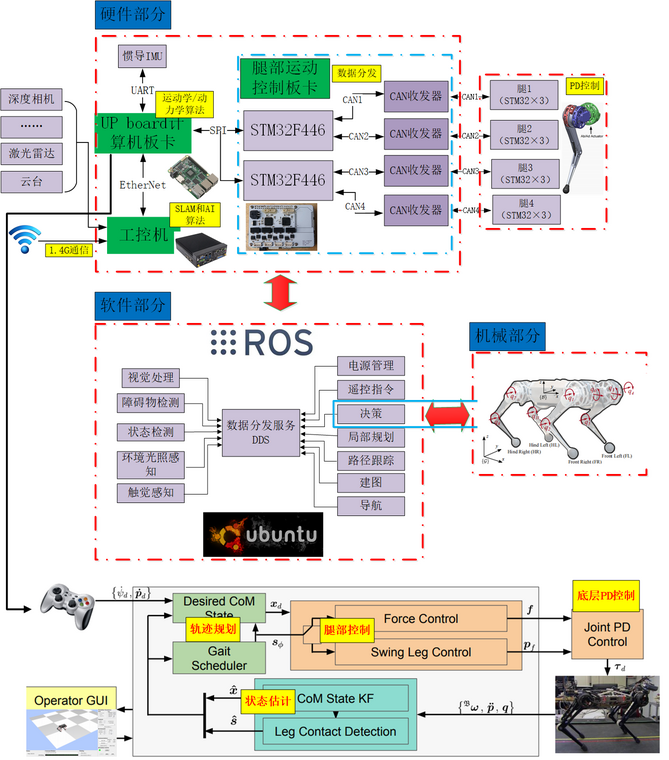

# The Wondrous Unreturnable Path | 奇妙的不归路

- 奇妙？如何奇妙，看看下面：

  

花花绿绿的多少能够勾起你的一点兴趣。

---

- 不归？如何不归，看看下面：

  从硬件的 `焊板子`、`IMU`、`驱动板`、`Keil`、`通信协议`，到软件的 `OpenCV`、`ROS`、`Linux`、`Qt`、`Unity`，再来个 `神经网络`、`SLAM`、`强化学习`、`路径规划`等等等等等，要不是爱得真，早就跟CV勾搭肩背了，家人们，who knows?

