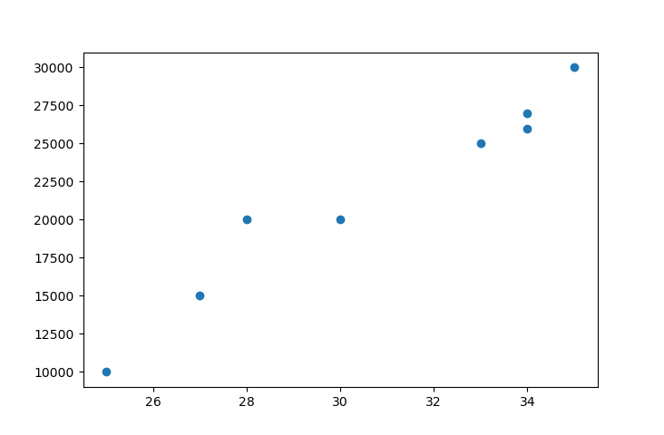
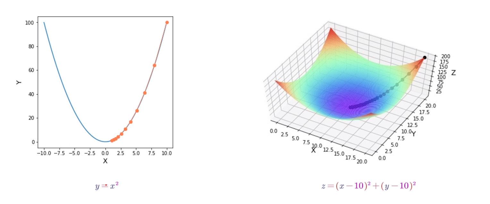
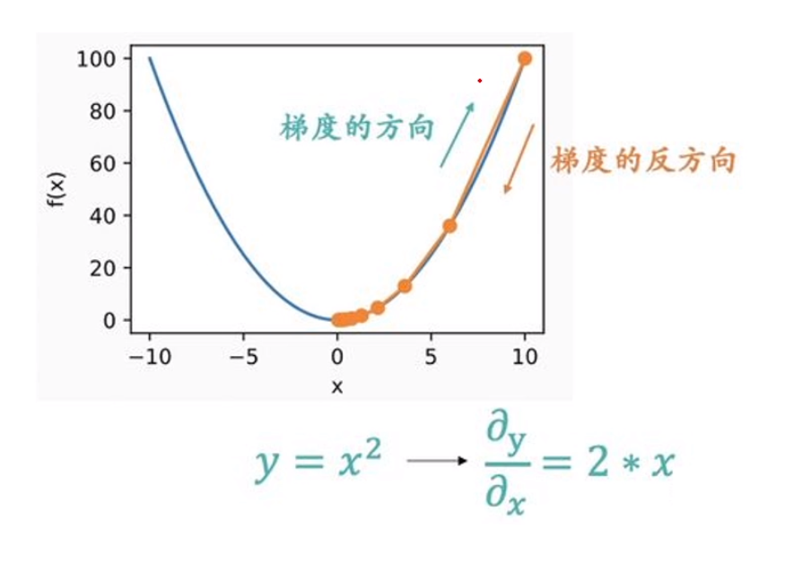

# Gradient Descent | 梯度下降法
## 抛砖引玉
### 砖 1
```python
import matplotlib.pyplot as plt

ages = [25, 27, 28, 30, 33, 34, 34, 35]
salary = [10000,15000,20000,20000,25000,26000,27000,30000]
plt.scatter(age, salary)
plt.show()
```
找到一条直线，让各点到该线距离之和最小。


该直线为一元一次线性方程: $y = kx + b(k \neq 0)$  
实际值$y_{i} = kx_{i} + b(k \neq 0)$  
预测值$y'_{i} = kx_{i} + b(k \neq 0)$
进行线性推广:$$y'_{i} = \sum_{i=1}^{n}\theta_{i}*x_{i} + \theta_{0} $$  

损失函数LostFunction:$$J_{\theta} = \frac{1}{n} \sum_{i=1}^{n}(y'_{i}- y_{i})^{2}$$

需要求出一组$\theta$，使得损失函数最小。

### 砖 2
下面时另外两个函数，要求他们的最小值？
如何求极值？最大值、最小值、鞍点？
$f'(x) = 0$？
梯度下降法！


## 两个问题
- 方向：能否到达终点。
- 步长：步长太大，会不断振荡；步长太小，迭代次数太多。

## 算法
1. 计算梯度$\nabla J_{\theta}$
2. 用$\alpha$表示步长，叫做`学习率`，$\nabla J_{\theta}(\theta_{i-1})$表示梯度所以更新$\theta$的公式为：
$$\theta_{i} = \theta_{i-1} - \alpha * \nabla J_{\theta}(\theta_{i-1})$$

比如函数 $y=x^{2}$ 则$\nabla J_{\theta}(\theta_{i-1}) = 2\theta$，设$\alpha = 0.2$，则：
$$\theta_{i} = \theta_{i-1} - 0.2 * 2\theta_{i-1}$$
`注：梯度的方向指的是指定点上升最快的方向，是上升`

下面为$y = x^{2} + b$的运算。
```python
x = 6.0
learning_rate = 0.1
num_iterations = 100

for i in range(num_iterations):
    gradient = 2 * x
    x = x - learning_rate * gradient
    y = x ** 2
    print(f"Iteration {i + 1}: x = {x}, y = {y}")

print("最终结果：")
print(f"x = {x}, y = {y}")
```