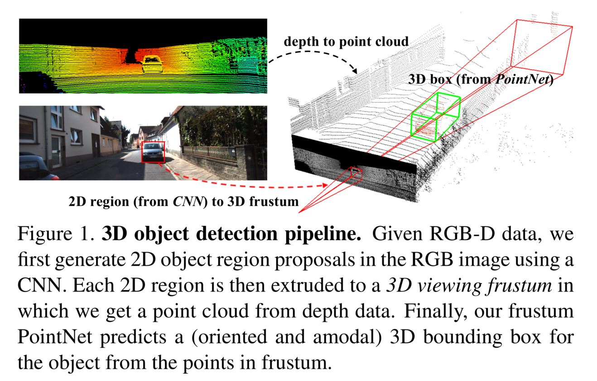

## Frustum PointNet

[论文链接](https://arxiv.org/pdf/1711.08488.pdf)

下图展示了该想法的一个pipeline。左边是RGB-D的input，左上的颜色表示深度，左下是RGB图片。算法首先基于2D 检测器找到目标(车)的2D边界框，然后结合给定的相机参数，则能确定 2D 边界框的视锥，如右图红色金字塔所示。最后在3D视锥的点云中找到车(绿色)或进行分类和分割。

