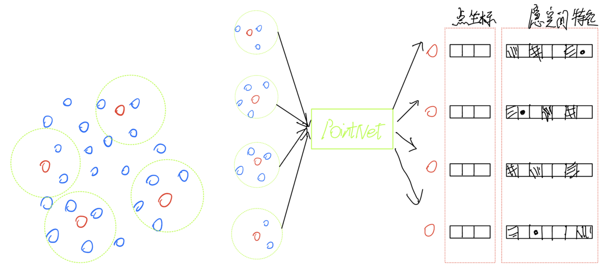
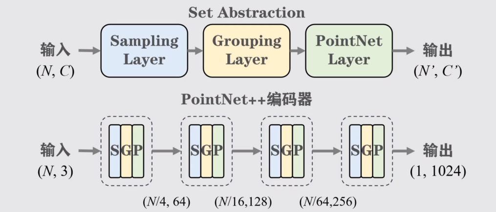
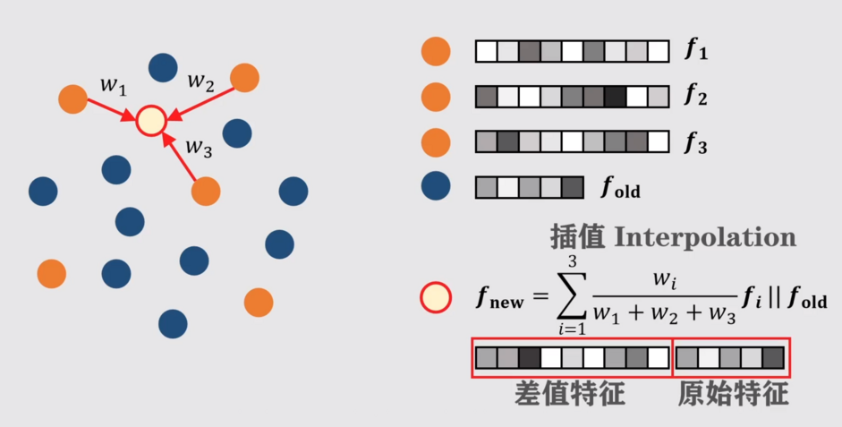

# PointNet++

## PointNet的问题

点云中并非所有点有用，提取有代表性的点更表现更好。PointNet对于细致结构，复杂结构的学习能力并不强。

## PointNet++

[论文链接](https://arxiv.org/pdf/1706.02413.pdf)

### 原理

首先利用最远点采样FPS提取出4个点，然后利用K近邻算法、球状邻域查询算法或其他算法划出每个点的邻域，然后利用PointNet网络提取特征。

上面的步骤叫做 `Set Abstracion`，PointNet++编码器使用了四个Set Abstracion模块，在这个过程中不断减少点的数量，并且增加通道数，是不是很像卷积神经网络的过程。  

### 点云分割

对于分割任务，我们可以将采样前的普通点提取其原始特征，利用其邻近的几个采样点与该普通点的距离进行融合特征的提取，然后拼接原始特征，对所有点采用次方法，就能恢复所有点的特征，这个过程叫做 `Feature Progation`。

## 后记

PointNet++网络最大的贡献是提出了一个架构，由 `采样`、`划邻域`、`特征提取`组成的一种点云处理架构，后续论文大多基于该架构，如2020年的RandLA-Net模型将最远点采样替换为 `随机采样`；2021年的Point Transformer框架使用自注意力机制替换了PointNet层等等等等。完结！

## 拓展阅读： FPS | 最远点采样

[链接](./FPS.md)
