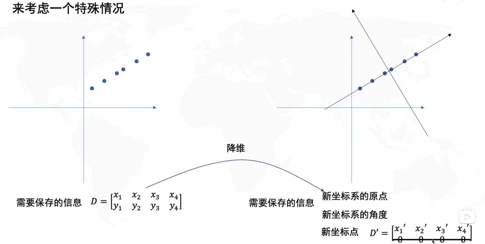
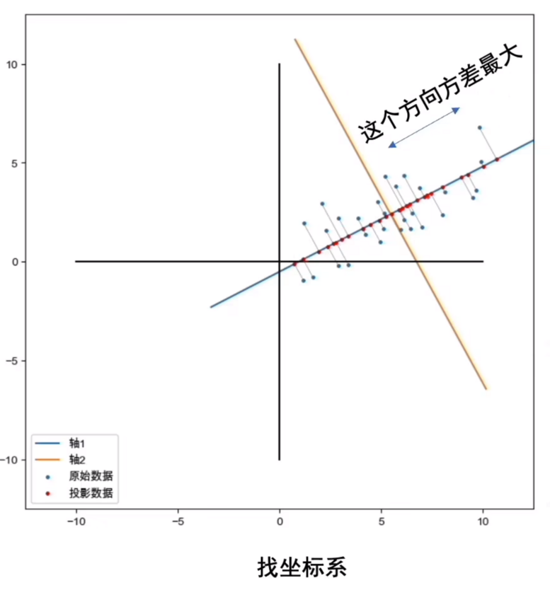
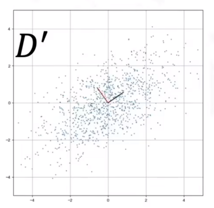
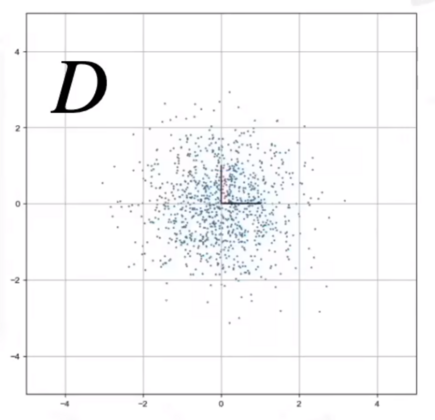

# PCA | 主成分分析法
PCA主要用于数据的降维，下图中把二维的信息转换到一维：

上述情况是特殊情况，所有点恰好在一条直线上。
在一般情况下，主成分分析法要求降维的同时`保留最多的信息`，如下图：

## 实现步骤
### 前置知识-初等变换矩阵
- 矩阵$S=\begin{bmatrix}2&0 \\0&1 \\\end{bmatrix}$可以将维度1拉伸为原来2倍，维度2不变，表现在二维的直角坐标系上就是$X$轴拉伸为2倍。  
- 矩阵$R=\begin{bmatrix}con(\theta)&-sin(\theta) \\sin(\theta)&con(\theta) \\\end{bmatrix}$在二维的直角坐标系上表现为旋转$\theta$度。

:::info

关于**协方差**请点击[协方差](../../Math/Linear%20Algebra/cov.md).

:::

### 降维
$D'$为我们手上的数据，需要转化为D，如下图： 

|||
|---|---|
|||  

$D'$可由$D$经过线性变换得到：$D' = RSD$ 

协方差公式为：$C=\frac{1}{n-1}DD^{T}$

$D'$的协方差公式为：  
$$C'=\frac{1}{n-1}D'D'^{T} \\
=\frac{1}{n-1}RSD(RSD)^{T} \\
=\frac{1}{n-1}RSDD^{T}S^{T}R^{T} \\
=RSCS^{T}R^{T} \\
=RSS^{T}R^{T}$$  

又由于$S^{T} = S$、$R^{T} = R^{-1}$,则
$$L = S^{T}S=\begin{bmatrix}
a^{2}&0 \\
0&b^{2} \\
\end{bmatrix} \\
C'R = RL$$  

有没有发现就是特征值的公式？其中R为特征特征向量组成的矩阵，就是新坐标系下各轴的方向，而L则是各轴拉伸的倍数。