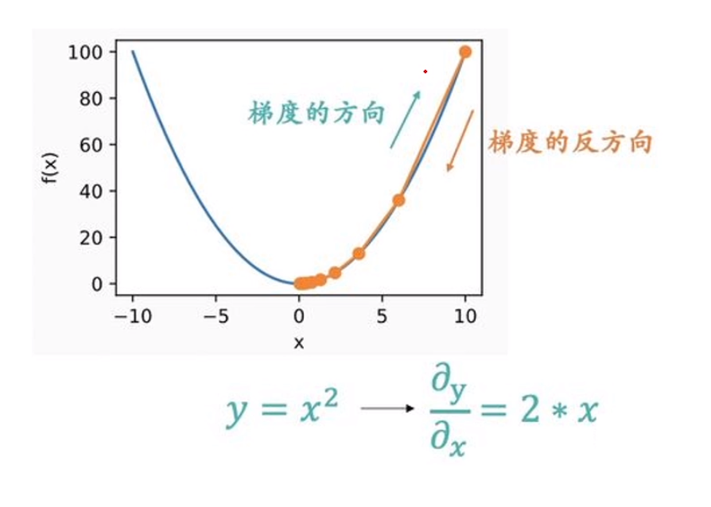

# Gradient Descent | 梯度下降法
## 抛砖引玉
### 砖 1
```python
import matplotlib.pyplot as plt

ages = [25, 27, 28, 30, 33, 34, 34, 35]
salary = [10000,15000,20000,20000,25000,26000,27000,30000]
plt.scatter(age, salary)
plt.show()
```
找到一条直线，让各点到该线距离之和最小。


该直线为一元一次线性方程: $y = kx + b(k \neq 0)$  
实际值$y_{i} = kx_{i} + b(k \neq 0)$  
预测值$y'_{i} = kx_{i} + b(k \neq 0)$  

进行线性推广:  
  
$$y'_{i} = \sum_{i=1}^{n}\theta_{i}*x_{i} + \theta_{0}$$
  
那么如何表示函数的拟合程度呢？对啰，求各点到直线的距离，得到的函数我们叫做损失函数  
`Loss Function`:$$J_{\theta} = \frac{1}{n} \sum_{i=1}^{n}(y'_{i}- y_{i})^{2}$$  


梯度下降就是求出一组$\theta$，使得损失函数最小，得到拟合的最优解。

### 砖 2
下面时另外两个函数，要求他们的最小值？
如何求极值？最大值、最小值、鞍点？
$f'(x) = 0$？
梯度下降法！


## 两个问题
- 方向：能否到达终点。
- 步长：步长太大，会不断振荡；步长太小，迭代次数太多。

## 算法
1. 计算梯度$\nabla J_{\theta}$
2. 用$\alpha$表示步长，叫做`学习率`，$\nabla J_{\theta}(\theta_{i-1})$表示梯度所以更新$\theta$的公式为：
$$\theta_{i} = \theta_{i-1} - \alpha * \nabla J_{\theta}(\theta_{i-1})$$

比如函数 $y=x^{2}$ 则$\nabla J_{\theta}(\theta_{i-1}) = 2\theta$，设$\alpha = 0.2$，则：
$$\theta_{i} = \theta_{i-1} - 0.2 * 2\theta_{i-1}$$
`注：梯度的方向指的是指定点上升最快的方向，是上升`
  

下面为$y = x^{2} + b$的运算。  

```python
x = 6.0
learning_rate = 0.1
num_iterations = 100

for i in range(num_iterations):
    gradient = 2 * x
    x = x - learning_rate * gradient
    y = x ** 2
    print(f"Iteration {i + 1}: x = {x}, y = {y}")

print("最终结果：")
print(f"x = {x}, y = {y}")
```

## Stochastic Gradient Descent | 随机梯度下降
回到我们的`砖1`，数据量还行，此时我们在求损失函数的时候可以计算每一个点的距离再加权平均，时间复杂度为$O(N^{2})$，大量数据的话会消耗大量的性能，因此有人提出了`随机梯度下降`，计算损失函数时不计算所有的点，而是挑选一部分点进行计算，这将大大减少性能损耗。
### 随机梯度下降拟合砖 1
```python
import random
import matplotlib.pyplot as plt

age = [25, 27, 28, 30, 33, 34, 34, 35, 36, 38, 40, 42, 45, 47]
salary = [10000, 15000, 20000, 20000, 25000, 26000, 27000, 30000, 32000, 35000, 38000, 40000, 45000, 48000]

m = random.uniform(0, 1)
b = random.uniform(0, 1)

learning_rate = 0.0005
num_iterations = 1000000

batch_size = 10 

# Loss Function
losses = []

#RGD
for i in range(num_iterations):
    indices = random.sample(range(len(age)), batch_size)
    x_batch = [age[index] for index in indices]
    y_batch = [salary[index] for index in indices]

    avg_dm = sum(2 * x * (m * x + b - y) for x, y in zip(x_batch, y_batch)) / batch_size
    avg_db = sum(2 * (m * x + b - y) for x, y in zip(x_batch, y_batch)) / batch_size

    m = m - learning_rate * avg_dm
    b = b - learning_rate * avg_db

    if i % 10000 == 0:
        loss = sum((m * x + b - y) ** 2 for x, y in zip(age, salary)) / len(age)
        losses.append(loss)
        print(f"Iteration {i}: 参数：m = {m}, b = {b}, 损失函数 = {loss}")

print(f"最终参数：m = {m}, b = {b}")

x_values = range(25, 48)
y_values = [m * x + b for x in x_values]

plt.scatter(age, salary, label='Data')
plt.plot(x_values, y_values, color='red', label='Fitted Line')
plt.xlabel('Age')
plt.ylabel('Salary')
plt.legend()
plt.show()

iterations = range(0, num_iterations, 1000)
plt.plot(iterations, losses, label='Loss')
plt.xlabel('Iterations')
plt.ylabel('Loss')
plt.legend()
plt.show()

```