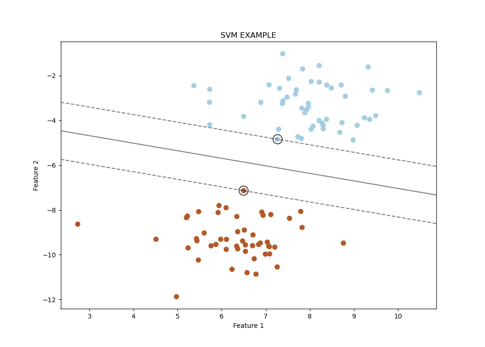

# Support Vector Machines ,SVM | 支持向量机
Support Vector Machines ,SVM（支持向量机）是一种强大的监督学习算法，用于分类和回归分析。


## 底层原理

支持向量机的目标是在数据点之间画出一个决策边界（超平面），以区分不同类别的数据。SVM的基本原理如下：
:::info

**超平面**是一个n-1维的空间，用于分隔n维空间中不同的类别或数据集。具体地说，对于一个二维数据集，超平面是一条直线，将空间分为两部分，用于将两个不同的类别或群集分开。

:::
1. **数据预处理**  
   在开始之前，需要对数据进行标准化或归一化，确保特征具有相似的尺度。

2. **寻找最佳超平面**  
   SVM试图找到一个最佳的超平面，以最大化两个类别之间的间隔（间隔最大化）。这个超平面将数据分为两个类别。

3. **支持向量**  
   支持向量是离超平面最近的数据点。它们对定义超平面和间隔起着关键作用。

4. **核函数**  
   当数据不是线性可分时，可以使用核函数将数据映射到高维空间，使其线性可分。
:::info
除了线性核的SVM，几种其他类型的**核函数**：  
**多项式核（Polynomial Kernel）：** 这个核函数允许SVM处理数据的多项式特性，通过添加一个多项式的项来转换数据到高维空间，使得原本线性不可分的数据在高维空间中变得线性可分。  
**高斯径向基函数核（Gaussian Radial Basis Function Kernel）：** 也称为RBF核，它可以将数据映射到无限维的空间，通过使用高斯分布来衡量点与中心点之间的距离，这种核函数通常在非线性问题中表现很好。  
 **Sigmoid核：** 这个核函数的工作原理类似于神经网络中的激活函数，它将数据映射到一个无穷空间，并允许在非线性问题中工作。
:::
## 例子

考虑一个简单的示例：分类两个特征的数据点，我们将使用线性核的SVM。

```cpp
#include <iostream>
#include <vector>
#include <opencv2/opencv.hpp>
#include <opencv2/ml.hpp>

int main() {
    // 样本数据
    std::vector<cv::Point2f> points = {cv::Point2f(2.0, 3.0), cv::Point2f(3.0, 3.0), 
                                       cv::Point2f(3.0, 4.0), cv::Point2f(2.0, 1.0), 
                                       cv::Point2f(3.0, 2.0), cv::Point2f(4.0, 3.0)};
    // 对应的标签
    std::vector<int> labels = {1, 1, 1, -1, -1, -1};

    // 转换为OpenCV的数据结构
    cv::Mat data = cv::Mat(points).reshape(1);
    cv::Mat responses(labels);

    // 创建SVM模型
    cv::Ptr<cv::ml::SVM> svm = cv::ml::SVM::create();
    svm->setType(cv::ml::SVM::C_SVC);
    svm->setKernel(cv::ml::SVM::LINEAR);
    svm->setTermCriteria(cv::TermCriteria(cv::TermCriteria::MAX_ITER, 100, 1e-6));

    // 训练模型
    svm->train(data, cv::ml::ROW_SAMPLE, responses);

    // 新数据点预测
    cv::Mat testPoint = (cv::Mat_<float>(1, 2) << 2.0, 2.0);
    float result = svm->predict(testPoint);

    // 打印预测结果
    std::cout << "预测结果：" << result << std::endl;

    return 0;
}
```