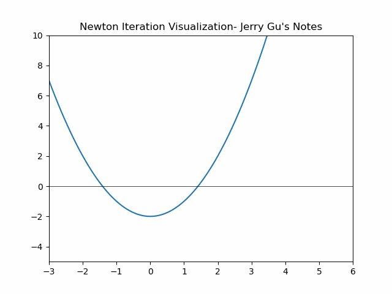

# Newton-Raphson Method | 牛顿迭代法

最简单的实现确定$\sqrt{2}$的近似值:  


## C++实现

```cpp
#include <iostream>
//定义初始值，对于收敛速度很重要
double x = 2;

//定义收敛步数，最好使用精度表示
int step  = 0;

// 返回x函数值
double f(double x){
    return x * x - 2;
}

//返回x点对应的导数
double fPrime(double x){
    return 2 * x;
}

int main(){
    while(step < 100){
        x = x- f(x) / fPrime(x);
        std::cout << "step" << step << ":" << x << std::endl;
        step++;
    }

    std::cout << x;
}
```

:::info

**可视化代码**请点击[这里](./Visualization.py).

:::