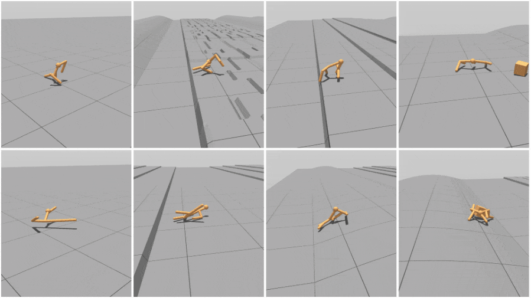
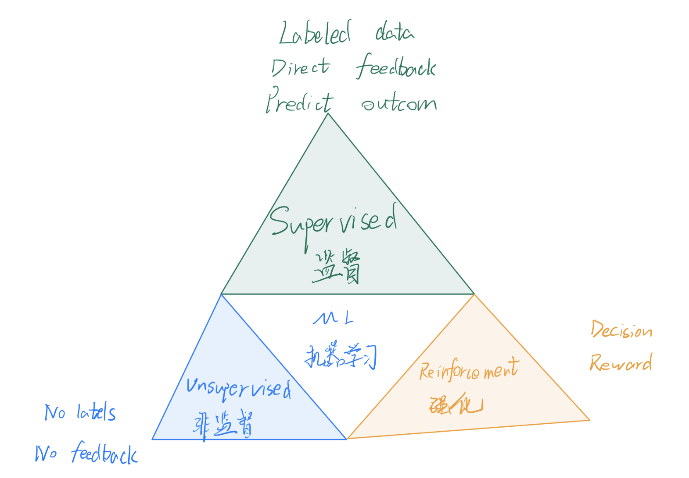
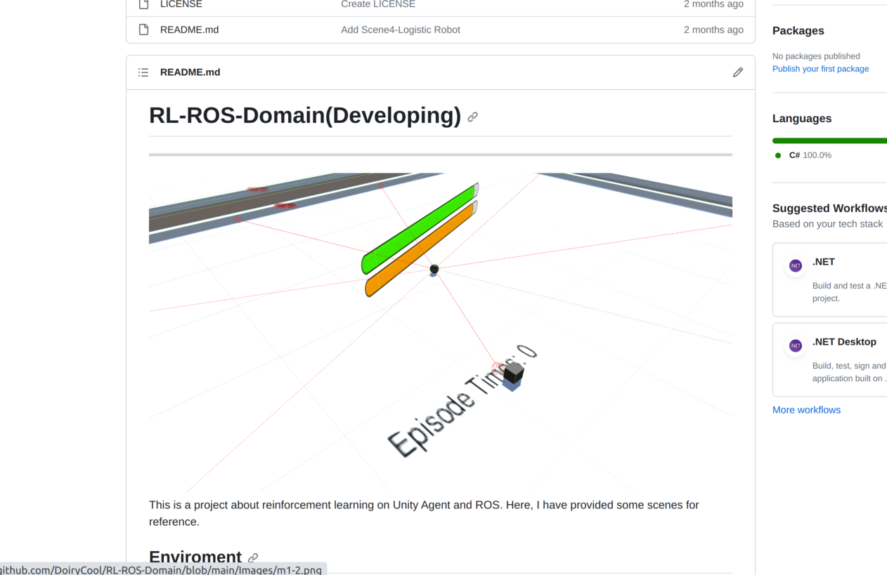

# 变强！变化！谓之强化！
之前看到网络上有一些视频，机器人或者小球（后面统一称谓Agent-智能体）独立摸索出如何利用自己的关节行走，如何躲避敌人（或者寻找猎物），感觉非常有趣，于是学了下强化学习，至于载体，普通的`Python`就可以做图形化的，但感觉不那么有趣，平常使用的`Gazebo`总感觉有点老古董，恰好`Unity`有现成的库，功能完善，于是用`Unity`，之前看了OpneAI也有针对机器人仿真的开源框架[robogym](https://github.com/openai/robogym)，使用的是[OpenAI gym](https://gym.openai.com/)，还没了解过，以后可以看看。

## 强化学习与监督、非监督学习

## ML-Agents
[ml-agents](https://github.com/Unity-Technologies/ml-agents)是一个Python项目，用来提供支持`强化学习`、`模仿学习`的API，与Unity交互再好不过了。

## RL-ROS-Domain
[RL-ROS-Domain](https://github.com/DoiryCool/RL-ROS-Domain)是本人正在开发的一个基于强化学习的项目，打算提供多种场景（生存游戏、强化学习驾驶、足球对抗等）用来帮助大家学习强化学习。
