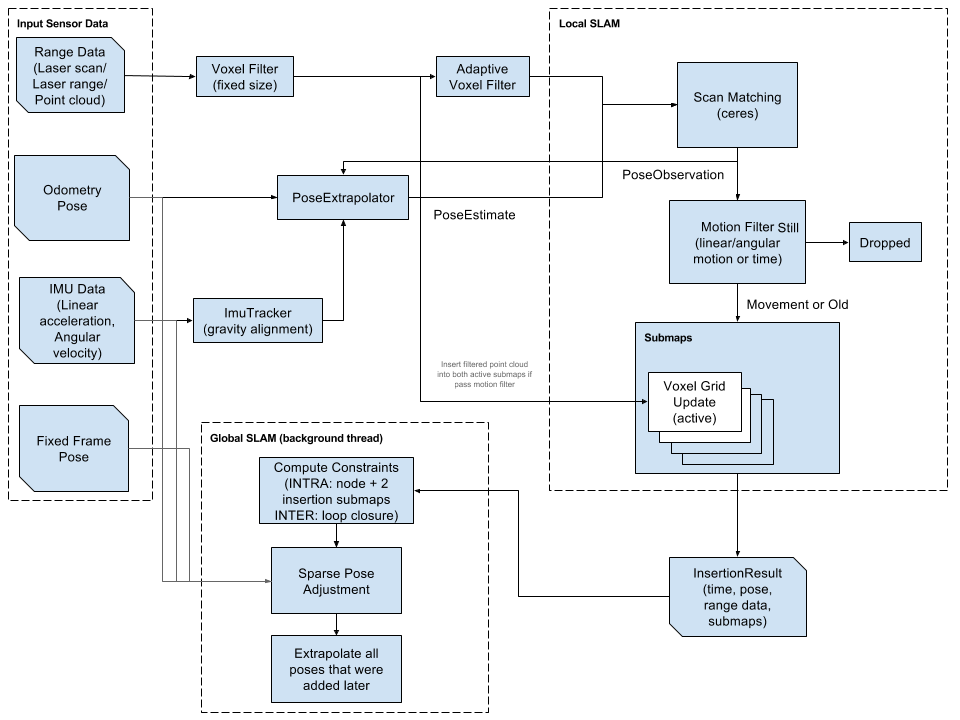

## 一、Introduction | 简介
Cartographer是由谷歌提出的一个SLAM多传感器融合的框架，可以处理来自`Lidar`、`IMU`和`Odometer`等传感器的数据。

## 二、Syatem | 架构

### Local SLAM | 前端
上图的左上角部分称为SLAM的前端，主要用来估计机器人目前的位置并生成局部的地图，参数设定在
- `/src/cartographer/configuration_files/trajectory_builder_2d.lua`
- `/src/cartographer/configuration_files/trajectory_builder_3d.lua`

### Global SLAM | 后端
Global SLAM 的作用是将多个`Local SLAM`结果连接起来，形成一个全局地图，并进行优化，如Loop Closure（回环检测）等。
:::info
BBA分支定界法请查看[这里](/notes/Algorithms/Optimization%20Algorithms/Branch-and-Bound%20Approach/)。
:::