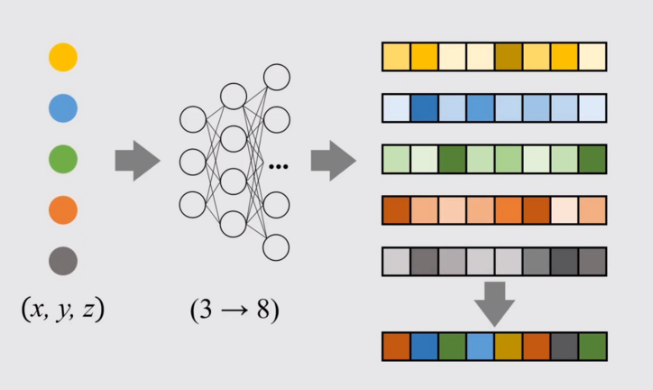
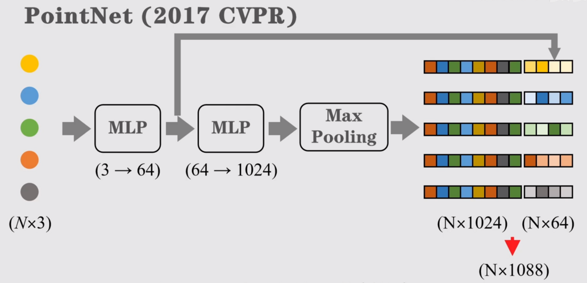

# PointNet

## 点云处理的问题

由于点云具有无序性（非结构化数据），传统神经网络无法进行处理，需要一种办法，使得无论输入顺序什么样，都能够得到相同的特征。

## PointNet

### 多层感知机

- 利用一个多层神经网络，叫做 `多层感知机(Multi-Layer Perceptron)`，将原来的3维特征编码至8维特征。
- 接着保存每个通道的最大值，于是就无关点云顺序，这个操作叫做 `最大值池化(Max Polling)`。

- 对于更多的点云处理任务，可以用更多感知机。
- 为了做分割任务，可以将第一层感知机输出的特征拼接到池化后的全局特征中，这样每个点都有属于自己的特征了。

那么有小伙伴问了，为了么选取最大值，用最大值池化，而非平均值、加权值呢？
看下表

| ModelNet40 Data Set  | Classification Accuracy |
| -------------------- | ----------------------- |
| Max Pooling          | 87.1%                   |
| Mean Polling         | 83.8%                   |
| Weighted Sum Pooling | 83.0%                   |

显然 `Max Polling`准确略最高，纯纯实验得出的结论。
