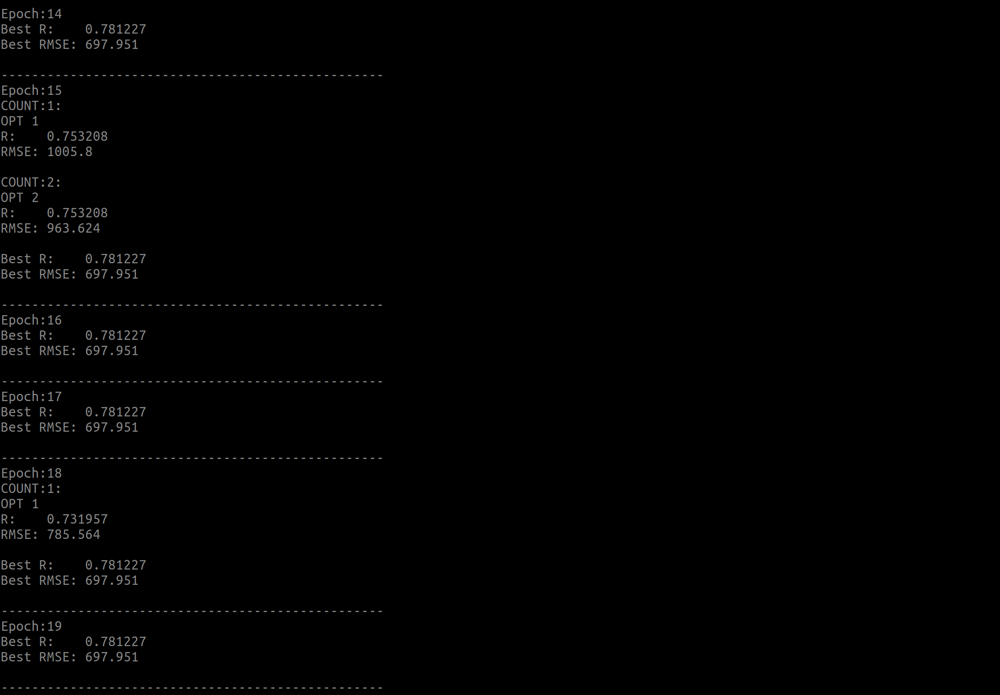
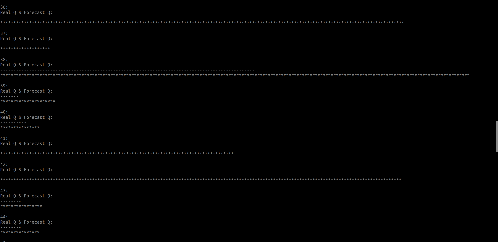

# 无意中的机器学习

最近翻到了一份大一写的代码，用最小二乘做一个径流量预测，想想还是满经典的，当时居然还想到做了个**时间序列**的加权，还有个微调，像极了机器系学习里的**学习率**，感觉还是不错的，哈哈哈哈，最近做了个Linux和Windows系统兼容。

## 训练过程

## 预测可视化

## 代码链接
点击[这里](https://github.com/DoiryCool/FreshCPP/tree/main/Annual%20runoff)