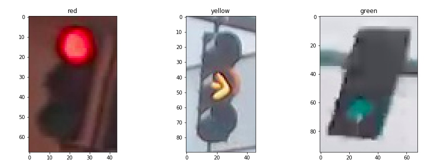
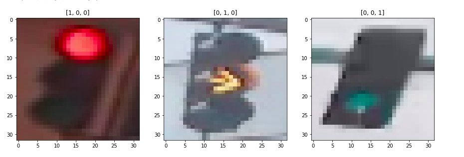
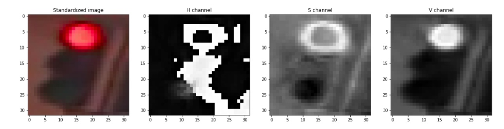
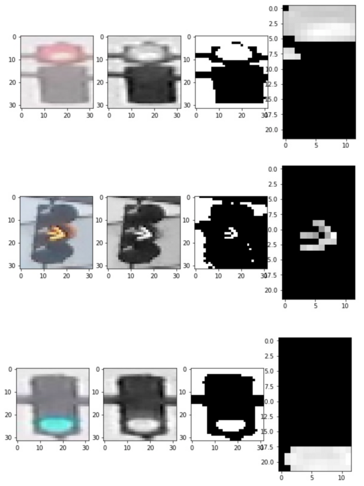

## 数据加载
首先从文件读取数据，并根据交通灯颜色分类，然后进行数据显示。
```python
red_images = [img for img in IMAGE_LIST if img[1]=='red']
yellow_images = [img for img in IMAGE_LIST if img[1]=='yellow']
green_images = [img for img in IMAGE_LIST if img[1]=='green']


f,(ax1,ax2,ax3) = plt.subplots(1,3,figsize=(15,5))
ax1.imshow(red_images[0][0])
ax2.imshow(yellow_images[0][0])
ax3.imshow(green_images[0][0])
ax1.set_title(red_images[0][1])
ax2.set_title(yellow_images[0][1])
ax3.set_title(green_images[0][1])
```
原始图片数据

## 数据预处理
图片存在下面的问题：
- 尺寸不统一
- 亮度不一致  
  
需要对图片进行预处理：
1. 标准化
2. 进行one-hot编码
```python
#标准化
def standardize_input(image): 
    standard_im = np.copy(image)
    standard_im = cv.Resize(standard_im,(32,32))
    return standard_im

#one-hot 编码
def one_hot_encode(label):
    if(label=='red'):
        one_hot_encoded = [1,0,0]
    elif(label=='yellow'):
        one_hot_encoded = [0,1,0]
    elif(label=='green'):
        one_hot_encoded = [0,0,1]    
    return one_hot_encoded

def standardize(image_list):
    standard_list = []
    for item in image_list:
        image = item[0]
        label = item[1]

        #标准化一幅图像
        standardized_im = standardize_input(image)

        # 编码
        one_hot_label = one_hot_encode(label)    

      standard_list.append((standardized_im, one_hot_label))
        
    return standard_list


STANDARDIZED_LIST = standardize(IMAGE_LIST)
```

打印图片看看效果


## 特征提取
我们可以从`亮度特征`和`色彩特征`两方面入手。
### 亮度特征
首先将图片转换成HSV颜色空间。
HSV指的是：
- Hue（色相、色调）：是色彩的基本属性，就是平常所说的颜色名称，如红色、黄色等。
- Saturation（饱和度）：是指色彩的纯度，越高色彩越纯，低则逐渐变灰，取0-100%的数值。
- Value（明度）：取0-100%。
```python
image_num = 0
test_im = STANDARDIZED_LIST[image_num][0]
test_label = STANDARDIZED_LIST[image_num][1]

# Convert to HSV
hsv = cv2.cvtColor(test_im, cv2.COLOR_RGB2HSV)

# Print image label
print('Label [red, yellow, green]: ' + str(test_label))

# HSV channels
h = hsv[:,:,0]
s = hsv[:,:,1]
v = hsv[:,:,2]
```

可以看到上图中`Value`对于图像的辨识度最高，因此选取`Value`作为特征。

至此，我们已经基本可以通过亮度特征确定了。

### 色彩特征
相比RGB，HSV空间更接近与人们对真实感知，因此我们让采用HSV空间进行色彩过滤，然后将三种颜色的对应的部分提取出来，计算像素点判断颜色


```python
def show_img(rgb,hsv,mask,masked):
    fig,(ax1,ax2,ax3,ax4) = plt.subplots(1,4,figsize=(20,20))
    ax1.imshow(rgb)
    ax2.imshow(hsv[:,:,2],cmap='gray')
    ax3.imshow(mask)
    ax4.imshow(masked)
    
    
def apply_mask(mask,rgb_image):
    masked_hsv_image = np.copy(rgb_image)
    masked_hsv_image[mask == 0] = [0, 0, 0]
    return masked_hsv_image


def get_sum_red(rgb_image):
    hsv = cv2.cvtColor(rgb_image, cv2.COLOR_RGB2HSV)
    lower_hsv = np.array([120, 50, 120]) 
    upper_hsv = np.array([180, 255, 255])
    mask=cv2.inRange(hsv,lower_hsv,upper_hsv)
    masked_hsv_image=apply_mask(mask,rgb_image)
    total = np.sum(masked_hsv_image[:,:,:])
    #show_img(rgb_image,hsv,mask,masked_hsv_image)
    
    return total

def get_sum_yellow(rgb_image):
    hsv = cv2.cvtColor(rgb_image, cv2.COLOR_RGB2HSV)
    lower_hsv = np.array([10, 50, 120]) 
    upper_hsv = np.array([70, 255, 255])
    mask=cv2.inRange(hsv,lower_hsv,upper_hsv)
    masked_hsv_image=apply_mask(mask,rgb_image)
    total = np.sum(masked_hsv_image[:,:,:])
    #show_img(rgb_image,hsv,mask,masked_hsv_image)
    
    return total


def get_sum_green(rgb_image):
    hsv = cv2.cvtColor(rgb_image, cv2.COLOR_RGB2HSV)
    lower_hsv = np.array([70, 50, 120]) 
    upper_hsv = np.array([100, 255, 255])
    mask=cv2.inRange(hsv,lower_hsv,upper_hsv)
    masked_hsv_image=apply_mask(mask,rgb_image)
    total = np.sum(masked_hsv_image[:,:,:])
    #show_img(rgb_image,hsv,mask,masked_hsv_image)
    
    return total


# (Optional) Add more image analysis and create more features
def create_feature_color(rgb_image):
    red_total = get_sum_red(rgb_image)
    yellow_total = get_sum_yellow(rgb_image)
    green_total = get_sum_green(rgb_image)
    feature=[0,0,0]
    
    return [red_total,yellow_total,green_total]
    
```

## 图像分类
之后再写。